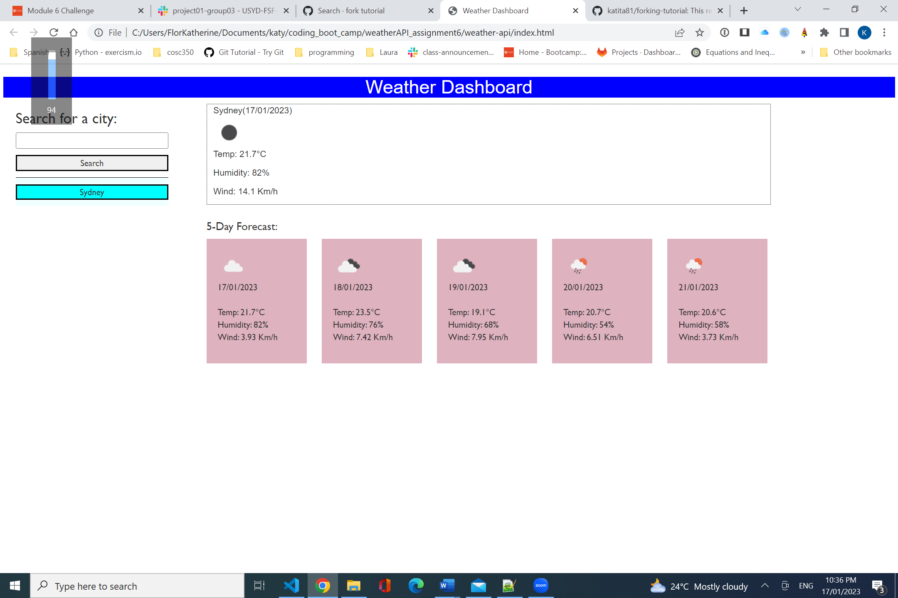
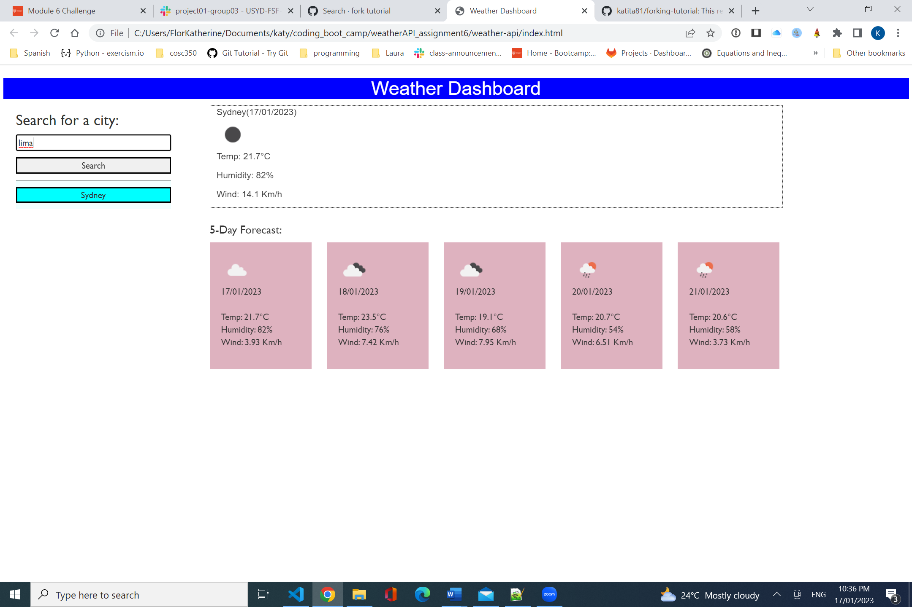
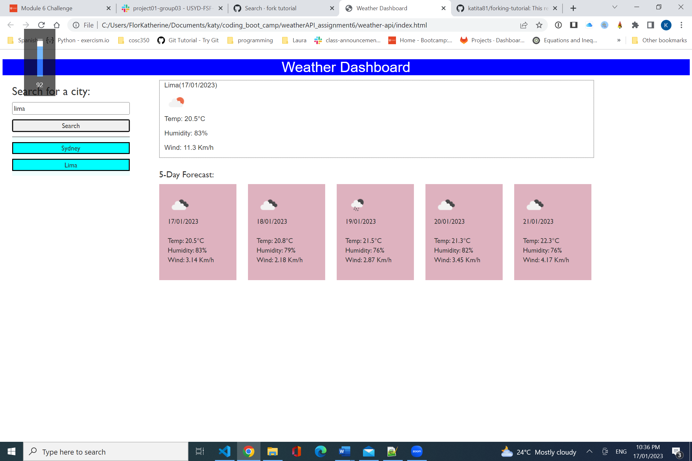
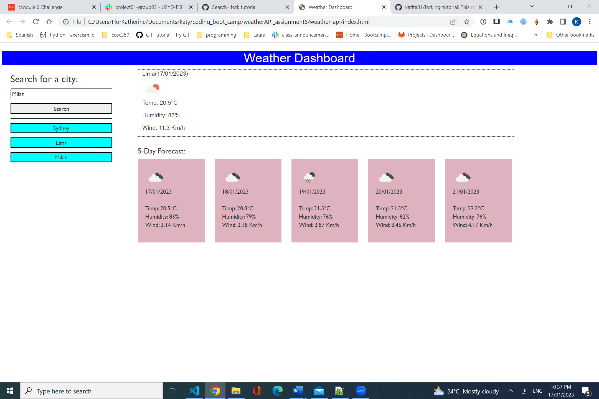

# Weather Dashboard

This Weather Dashboard is Weather API application that shows the current date and the weather characteristics (temperature, humidity and wind) for a given city, including the weather for the next five days. The desired city can be searched by typing in the text input field and by clicking on the "Search" button. Then the city weather features for today and the next five days will be displayed. If the city has not been searched before the application will create a button with the name of the newly searched city, and store the city name in local storage. the city name buttons will make faster retrieval of the city weather instead of typing it on the search input field.

Repository link: <http://github.com/katita81/weather-api>

Live link: <http://katita81.github.io/weather-api>